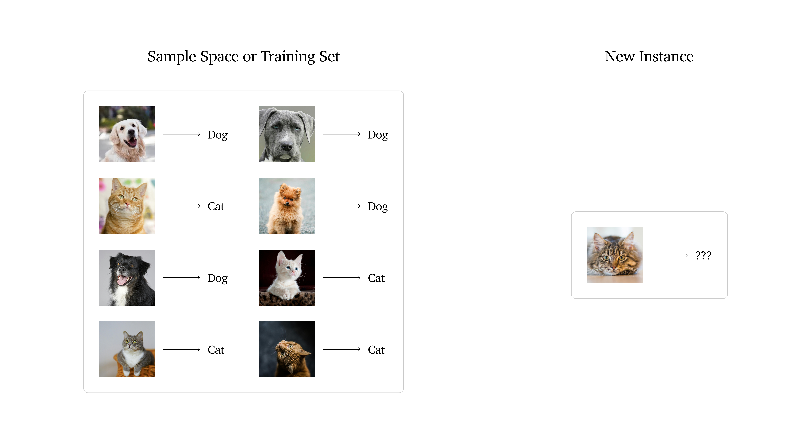

# Machine Learning: From Rules to Algorithms — A beginner’s guide.

#### Law 2: “To master it you must create an obligation to teach it” — Steven Bartlett, The Diary of a CEO

As a final-year undergraduate student majoring in Machine Learning, I’ve long wanted to share my learnings and thoughts on this field. Machine learning, deep learning, AI — all these fascinating technologies that empower our daily lives rather than handicap them.

When I think about everything I’ve learned, my mind immediately jumps to deep learning, convolutional neural networks, principal component analysis, and all the other amazing concepts that inspired me to pursue a degree in machine learning.

After much thought, I decided to start writing from the very beginning. So, let’s talk about machine learning — what exactly is this fancy term all about, fancy at least to me?

#### “I couldn’t reduce it to the freshman level. That means we really don’t understand it” — Richard Feynman

## What is machine learning?

Question: How do we teach a computer to differentiate between a cat and a dog? There are two things I hope to achieve with this question.

- First, to applaud human intelligence and our ability to perform tasks that would require a large amount of computational power.
- Second, to celebrate the work of researchers who have continuously discovered new ways and techniques to create artificial intelligence. The success attained so far cannot be overstated — AI is all around us, and it leaves me excited for what the future has in store and what role I will play in it.
Back to our question — how do we teach a computer to differentiate between a cat and a dog?

One way is through ‘traditional programming,’ where we write specific code instructions for the computer to follow. In this approach, we tell the computer exactly what features to look for in a dog and a cat. Here we are giving the computer step-by-step rules to follow.

The more I think about it, the more I realize how complex this task is. There are so many details to consider, like variations in size, color, and breed. It’s amazing that our brains can do it effortlessly. This makes traditional programming a less desirable approach because it doesn’t allow the system to learn or adapt on its own..

Machine learning solves this problem by letting computers learn from examples. Instead of giving the computer step-by-step rules, we show it many pictures of dogs and cats, each labeled correctly. The computer studies these pictures and figures out what makes a dog different from a cat. Over time, it gets better at telling them apart on its own. This way, the computer learns like we do, by looking at lots of examples and practicing.

Thus, similar to how humans learn from practice and examples, “machine learning is a way of teaching computers to learn from data and improve over time without being explicitly programmed for each task.”

## Types of Machine Learning Systems

## Supervised Learning

Let’s revisit the example above. Imagine you want to teach a computer to tell the difference between cats and dogs. In supervised learning, you help the computer learn by showing it many pictures of both cats and dogs, each with a label that tells the computer whether it’s a cat or a dog.

Each picture along with its label is called a sample. For example, Sample 1 might be a picture of a dog with the label “dog,” and Sample 2 might be a picture of a cat with the label “cat.”

Just like a child learns to recognize animals by seeing many samples and being told their names, the computer learns from these labeled samples. After seeing enough samples, the computer gets better at figuring out whether a new picture is of a cat or a dog based on what it has learned.

### Supervised learning is the machine learning task of learning a function that maps an input to an output based on example input-output pairs (Mahesh, 2019).

## Unsupervised Learning

Unsupervised learning is a bit different from supervised learning. Instead of teaching the computer with labeled examples, we only give it a bunch of pictures without telling it which ones are cats and which ones are dogs.

In unsupervised learning, the computer tries to figure out patterns and group similar pictures together on its own. For example, it might notice that some pictures have features like pointy ears and small noses, while others have different features, and it groups these pictures into clusters.

So, if you show the computer many pictures without labels, it might end up creating its own categories, like one group for pictures with certain features and another group for different features. It’s like letting the computer explore and organize the information by itself.

### In unsupervised learning, the system tries to learn without a teacher (Géron, 2017).

## Semi Supervised Learning

Semi-supervised learning is a blend of supervised and unsupervised learning. Imagine you have a lot of pictures of cats and dogs, but only some of these pictures are labeled with “cat” or “dog,” while the rest are unlabeled.

In this approach, you use the labeled pictures to teach the computer about what cats and dogs look like. Then, the computer also examines the unlabeled pictures to find patterns and make sense of them. This helps the computer learn more effectively by combining the guidance from labeled data with the extra information from the unlabeled data.

### Semi-supervised learning is a machine learning method that uses a small amount of labeled data and a larger amount of unlabeled data to improve learning accuracy. The labeled data helps guide the learning process, while the unlabeled data helps the model understand the structure of the data better.

## Reinforcement Learning

Reinforcement learning is like teaching a computer through trial and error, similar to how we learn from our experiences. Imagine you’re training a robot to navigate a maze. The robot doesn’t know how to get to the exit, so it starts exploring the maze.

As the robot moves around, it receives feedback in the form of rewards or penalties. For example, it might get a reward for moving closer to the exit and a penalty for hitting a wall. Over time, the robot learns which actions lead to rewards and which ones lead to penalties. It uses this experience to make better decisions and find the best path to the exit.

### Reinforcement learning is a type of machine learning where an agent learns to make decisions by performing actions in an environment, receiving rewards or penalties based on those actions, and using that feedback to improve its future decisions.

## When to use Machine Learning

### ‘If you can build a simple rule-based system that doesn’t require machine learning, do that.’ — Google’s Machine Learning Handbook

Here are some cases where you should use machine learning:

- Complex Patterns: Use machine learning when the problem involves complex patterns or relationships that are difficult to capture with simple rules. For example, predicting stock prices or understanding natural language.

- Large Datasets: If you have a large amount of data, machine learning can help uncover insights and make predictions that are hard to identify manually.

- Dynamic Data: When the data changes frequently or evolves over time, machine learning models can adapt and update based on new information.

- Automation: Use machine learning to automate tasks that require decision-making based on data. For instance, sorting emails into categories or recommending products.

- Improving Over Time: Machine learning is useful when you want a system that improves its performance as it is exposed to more data and learns from experience.

- Predictive Tasks: When you need to make predictions about future events based on historical data, such as forecasting sales or detecting fraudulent transactions.

If you’ve made it this far, I hope I’ve managed to give you a clear and simple introduction to machine learning, without diving too deep into the technical details. I wrote this post to reflect what I wanted to know when I first encountered the world of machine learning. My goal is to continue exploring and writing about various ML topics, with my next post focusing on supervised learning. I’d love to hear your feedback and any suggestions for improvement. If you found this post helpful, please give it a like and stay tuned for more insights on machine learning — a student’s perspective!

[Medium](https://medium.com/@k.boafo/machine-learning-from-rules-to-algorithms-a-beginners-guide-130d7f1cdbfa)

## References

- Mahesh, B., 2019. Machine Learning Algorithms: A Review. [pdf] Available at: https://www.researchgate.net/profile/Batta-Mahesh/publication/344717762_Machine_Learning_Algorithms_-A_Review/links/5f8b2365299bf1b53e2d243a/Machine-Learning-Algorithms-A-Review.pdf?eid=5082902844932096t [Accessed 27July 2024].

- Géron, A., 2017. Hands-On Machine Learning with Scikit-Learn and TensorFlow. 1st ed. O’Reilly Media.